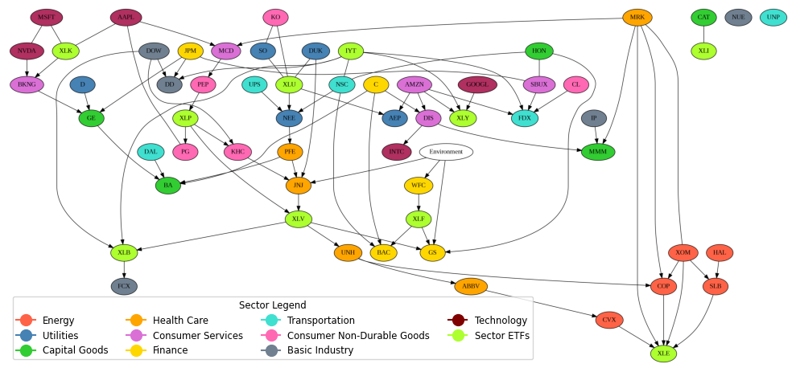

# Causal Discovery for Enhanced Stock Price Prediction

---

## Overview

This project explores how causal discovery can be used to improve stock price prediction. We apply the CD‑NOD algorithm to uncover causal relationships in financial time series data — identifying stocks that influence the target stock (Boeing, Ticker: BA) — and compare performance between a baseline LSTM model and a causally‑informed LSTM that uses these causal features.

The work was completed as a course project for DSC 245: Causal Inference at UC San Diego.

---

📄 **Full Project Report:** [Read the detailed write‑up (PDF)](./Causal%20Discovery%20for%20Enhanced%20Stock%20Price%20Prediction.pdf)  

---

## Project Structure

### [`01_data_preprocessing_and_causal_discovery.ipynb`](./01_data_preprocessing_and_causal_discovery.ipynb)

- Downloads stock price data using `yfinance` for 60 stocks, sector ETFs, and the VIX index
- Performs feature engineering (moving averages, RSI, volatility, etc.)
- Applies the CD-NOD algorithm to discover a causal graph between stock time series
- Outputs a causal skeleton graph showing influences on Boeing

### [`02_model_training_and_evaluation.ipynb`](./02_model_training_and_evaluation.ipynb)

- Trains two LSTM-based models:
  - A **baseline LSTM** using only Boeing's past prices
  - A **causally-informed LSTM** that also uses features from GE and DAL, discovered via CD-NOD
- Compares performance on a held-out test set

---

## Data

- **Source:** Yahoo Finance via the `yfinance` API
- **Period:** January 1, 2020 – January 1, 2024
- **Assets:** 60 individual stocks from multiple sectors, ETFs (XLE, XLK, XLI), and the VIX
- **Target:** Boeing (BA)

---

## Methodology

### Causal Discovery

We use **CD-NOD** (Causal Discovery from Non-Stationary/Heterogeneous Data), which is designed to exploit distribution shifts in time series data. It identifies variables that have a likely causal influence on the target — in this case, Boeing (BA).

Below is the causal skeleton generated by CD-NOD across all 60 stocks, sector ETFs, and the VIX:

### Model Architecture

Both models use the same LSTM structure with:

- 60-day lookback window
- Dropout = 0.2
- MSE loss, trained and evaluated on the same data splits

---

## Results

| Model                   | MAE (Test) | RMSE (Test) |
|------------------------|------------|-------------|
| Baseline LSTM          | **6.37**   | **8.17**     |
| Causally-Informed LSTM | **6.04**   | **7.65**     |

> Using features from causally connected stocks (GE and DAL) led to improved performance.

---

## Key Takeaways

- CD-NOD identified causal relationships in raw financial data without requiring returns or stationarity.
- A causally-informed LSTM model outperformed the baseline on MAE and RMSE.
- This suggests that incorporating causal structure into predictive models can yield meaningful improvements — especially in dynamic, volatile domains like financial forecasting.

---

## Future Work

- Generalize approach to other stocks or sectors
- Add macroeconomic variables (e.g. interest rates, inflation)
- Experiment with more advanced architectures like Transformers
- Explore real-time deployment as a trading signal or decision support tool

---

